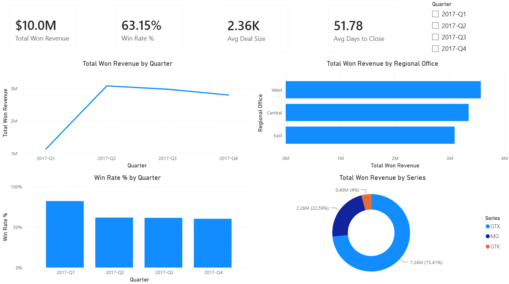
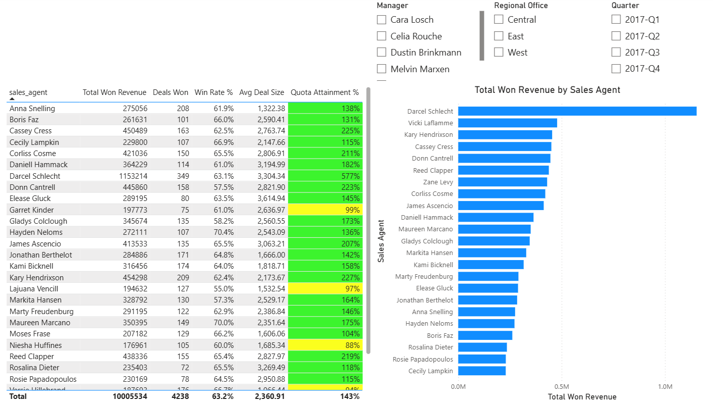
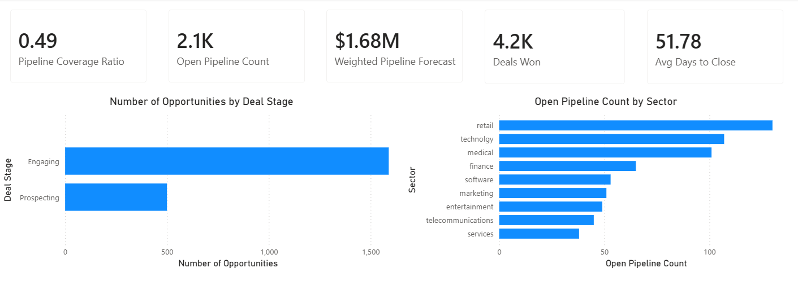
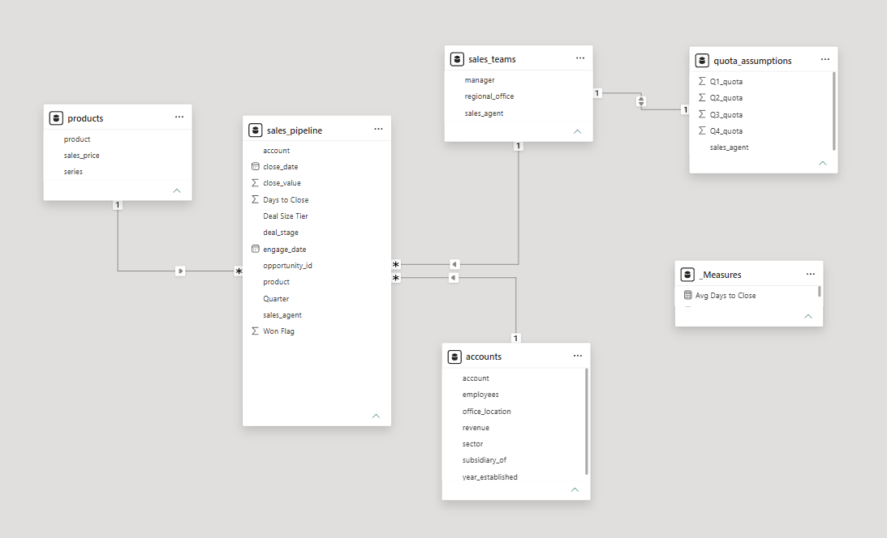
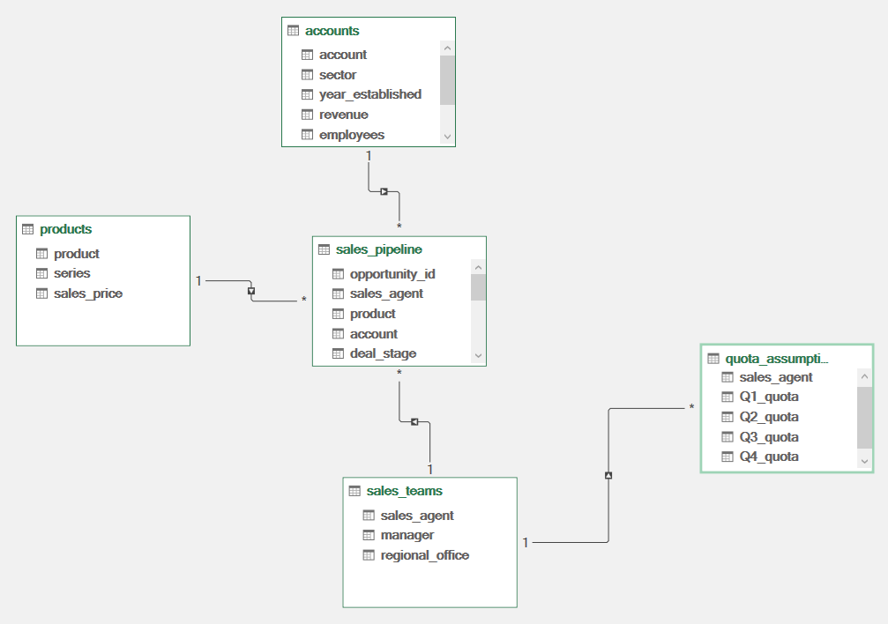

# Maven Tech — FP&A Sales Performance & Pipeline Intelligence Dashboard

Simulating a quarterly business review for a B2B technology company using a multi-table CRM data model built in Excel and Power BI. The analysis is framed as a budget-vs-actual and variance-to-plan exercise, using sales quotas as the budget baseline.

## Executive Summary

Maven Tech closed $10.0M in won revenue across 2017, driven primarily by the GTX product series (73.4% of revenue) and the retail sector (18.7% of revenue). Win rates declined from 82.1% in Q1 to 60.3% by Q4 — a 21.8-point unfavorable variance — suggesting volume growth came at the cost of sales efficiency. Open pipeline coverage ratio of 0.49x indicates the current funnel may be insufficient to sustain Q4 revenue levels going forward.

## Business Questions

- How did won revenue trend across quarters in 2017, and what drove the Q2 peak?
- Which sales agents are above, at, or below quota — and what does the attainment (budget vs. actual) distribution look like across the team?
- Is win rate declining as deal volume increases, suggesting a quality vs. quantity tradeoff?
- Which product series and customer sectors drive the most revenue — and where is concentration risk highest?
- Does the current open pipeline provide sufficient coverage to sustain future revenue targets, or does it signal forecast risk?
- What is the total commission expense under a tiered accelerator model, and how does it vary by agent performance?

## Tools & Skills

### Excel
- Power Query (M language) — data ingestion, transformation, and engineered columns across 4 source tables
- Power Pivot — DAX calculated columns (List Price, Discount Rate) and star schema data modeling
- Pivot Tables — 6 analysis tabs covering revenue, win rate, attainment, pipeline, product mix, and account segments
- Self-engineered quota assumptions table — agent-level quarterly targets built from scratch
- Commission accelerator model — tiered payout calculation (5% base, 8% above quota) across 35 agents
- Budget vs. actual / flux analysis — quarterly variance narrative explaining drivers behind win-rate and revenue swings

### Power BI
- Star schema data model with 5 tables and 4 active relationships
- DAX measures — 8 measures including Weighted Pipeline Forecast and Pipeline Coverage Ratio
- 3-page interactive dashboard with slicers, conditional formatting, and KPI cards
- Imported directly from Excel workbook — Power Query transformations carry through automatically

### Data Source
Maven Analytics CRM Sales Opportunities dataset (Kaggle) — 5 CSVs, 8,800 rows

## Data Model

The project uses a star schema with sales_pipeline as the central fact table and four dimension tables:

| Table | Role | Key Field |
|---|---|---|
| sales_pipeline | Fact table | opportunity_id |
| sales_teams | Dimension | sales_agent |
| accounts | Dimension | account |
| products | Dimension | product |
| quota_assumptions | Self-built dimension | sales_agent |

**Relationships:**
- sales_pipeline (account) → accounts (account)
- sales_pipeline (product) → products (product)
- sales_pipeline (sales_agent) → sales_teams (sales_agent)
- sales_teams (sales_agent) → quota_assumptions (sales_agent)

**Engineered Columns (Power Query — M language):**
- Won Flag — binary 1/0 for quick aggregation
- Days to Close — sales cycle length in days; nulls on open deals expected
- Quarter — derived from close_date; falls back to engage_date for open pipeline
- Deal Size Tier — Small (<$1K), Mid ($1K–$3K), Large (>$3K), Open - No Value

**Data Quality Notes:**
- 500 Prospecting deals across multiple agents have no dates or close values — CRM hygiene issue in source data
- GTXPro vs GTX Pro naming mismatch in source data — corrected in Power Query via Replace Values
- Some deals closed above list price showing negative discount rate — pricing anomaly in source data

## Key Findings

### Revenue Performance
- Maven Tech closed $10,005,534 in won revenue across 2017
- Q2 was the peak quarter at $3,086,111 — a 172% jump from Q1's $1,134,672
- Q3 and Q4 both declined (-3.4% and -6.0% respectively), suggesting momentum softened after Q2
- Q1 had the highest win rate (82.1%) but lowest revenue — fewer deals but most of them closed

### Win Rate & Sales Efficiency
- Overall win rate: 63.2% across 4,238 closed deals
- Win rate declined from 82.1% in Q1 to 60.3% in Q4 — volume growth came at the cost of conversion efficiency
- Average deal size: $2,362 | Average days to close: 51.78 days

### Sales Team Performance
- Darcel Schlecht is the clear outlier at $1,153,214 won revenue — 576% of annual quota
- Only 1 agent below 75% quota attainment: Violet McLelland at 61.7%
- Team total attainment: 166.8% against $7M in combined quota — a favorable variance to plan overall, though concentrated in a few top performers
- Total commission expense: $625,299 (6.25% of won revenue) under a tiered accelerator model (5% base, 8% above quota)

### Product Mix
- GTX series dominates at 73.4% of revenue ($7.34M) — heavy concentration risk
- MG series accounts for 22.6% ($2.26M)
- GTK series is a minor contributor at 4.0% ($400K)

### Account Segments
- Retail is the largest sector at 18.7% of revenue ($1.87M)
- Top 3 sectors (Retail, Technology, Medical) account for 47.4% of total revenue
- Employment is the smallest sector at 4.4% ($436K)

### Pipeline & Forecast
- 2,089 open opportunities — 1,589 Engaging, 500 Prospecting
- Pipeline coverage ratio: 0.49x — below the healthy 3x benchmark, indicating thin forward coverage and elevated forecast risk heading into next year
-  Weighted pipeline forecast: $1.68M applying stage-based win probabilities (40% Engaging, 15% Prospecting)

**Note on Pipeline Coverage Ratio:** The pipeline coverage ratio of 0.49x reflects open opportunity count relative to total annual won deals. This is a directional indicator — a complete coverage analysis would require forward quota targets and estimated deal values on open opportunities, which were not available in this dataset.

## Project Structure

```
crm-sales-fpa/
├── data/
│   ├── sales_pipeline.csv
│   ├── sales_teams.csv
│   ├── accounts.csv
│   ├── products.csv
│   └── data_dictionary.csv
├── excel/
│   └── data_model.xlsx
├── powerbi/
│   └── maven_fpa_dashboard.pbix
├── images/
│   ├── excel_data_model.png
│   ├── powerbi_data_model.png
│   ├── page1_executive_summary.png
│   ├── page2_sales_team_performance.png
│   └── page3_pipeline_forecast.png
└── README.md
```

## Dashboard Screenshots

### Executive Summary


### Sales Team Performance


### Pipeline & Forecast


### Data Model — Power BI


### Data Model — Excel

